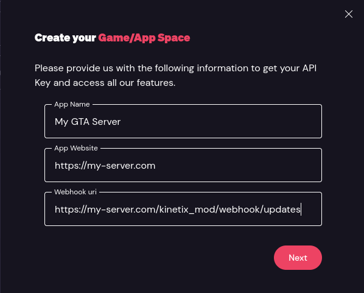
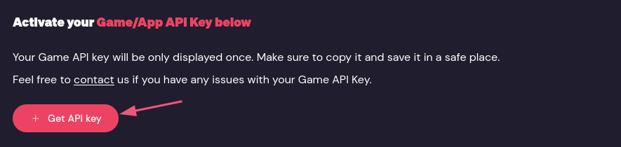
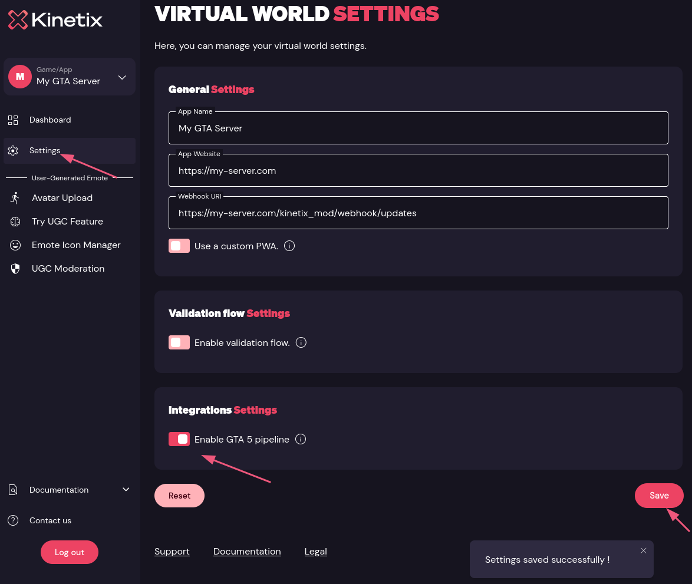

[](https://discord.gg/aCrvQcCb7C)


  # AI Emote Creator - FiveM

This is a FiveM resource allowing servers to integrate a User-Generated Emote feature. Servers that integrate it will empower their players to craft custom emotes (3D animations) from a video, directly in the game, and play it on their avatar. 

[Watch the AI Emote Creator demo video](https://youtu.be/NbgYFHHiAVw)

> [!CAUTION]  
> This resource relies on Kinetix's User-Generated Emote technology. The access to Kinetix's technology on FiveM servers is a paid service, as of the latest company's policy. The standard price for generating an animation with AI is just $0.20 per emote, billed to the server at the end of each month by Kinetix. Servers can integrate the script for free and run up to 20 free tests.


### 📚 Documentation

- [Read our documentation](https://fivem.docs.kinetix.tech/)

### Prerequisite

This mod requires : 
- [ox_lib](https://github.com/overextended/ox_lib)
- [_fivem_webbed_](https://github.com/Cyntaax/fivem-webbed) (not required since v0.1.10)

### Installation

Download the [latest release](https://github.com/git-kinetix/kinetix-fivem/releases/latest).

Extract the zip file into your server's resource folder.

### Configuration

- Create an account on Kinetix's [Developer Portal](https://portal.kinetix.tech).

- Get started by creating an App

&nbsp;&nbsp;&nbsp;&nbsp;&nbsp;&nbsp;&nbsp;&nbsp;&nbsp;&nbsp;&nbsp;&nbsp;

- In the dashboard page, generate an API Key and set it in your kinetix_mod resource (kinetix_mod/server/core.lua)

&nbsp;&nbsp;&nbsp;&nbsp;&nbsp;&nbsp;&nbsp;&nbsp;&nbsp;&nbsp;&nbsp;&nbsp;

- Get to the setting page
  - In the webhook field, set your server's public IP / Domain name with '/kinetix_mod/webhook/updates' 
    - example : https://my-server.com/kinetix_mod/webhook/updates
  - Enable the YCD file generation

&nbsp;&nbsp;&nbsp;&nbsp;&nbsp;&nbsp;&nbsp;&nbsp;&nbsp;&nbsp;&nbsp;&nbsp;

- Add these ACE rules in your server config (not required since v0.2.0)
  ```
  add_ace resource.kinetix_mod command.restart allow
  add_ace resource.kinetix_mod command.start allow
  add_ace resource.kinetix_mod command.stop allow
  add_ace resource.kinetix_mod command.refresh allow
  ```

- Restart the server

### Usage

The default key to open the animation creation menu is `F5`. This can be changed in kinetix_mod/client/core.lua

The default key to open the emote wheel is `Z` (or `W`), the default ox_lib's radial menu shortcut. 
